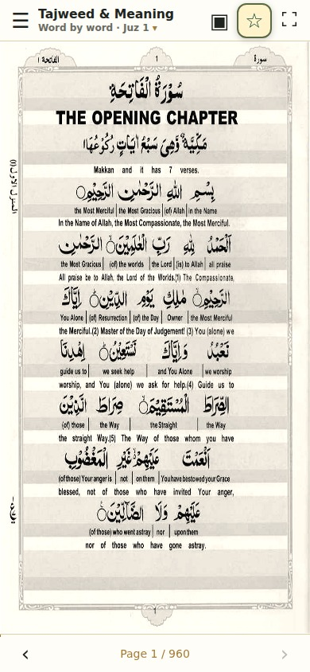
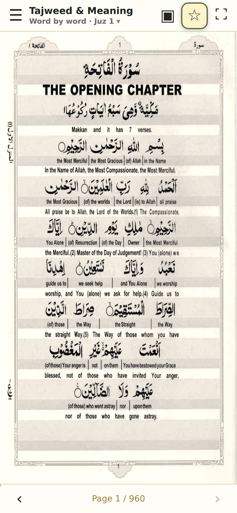
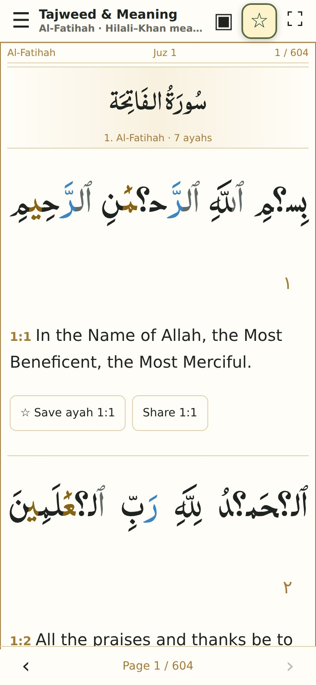
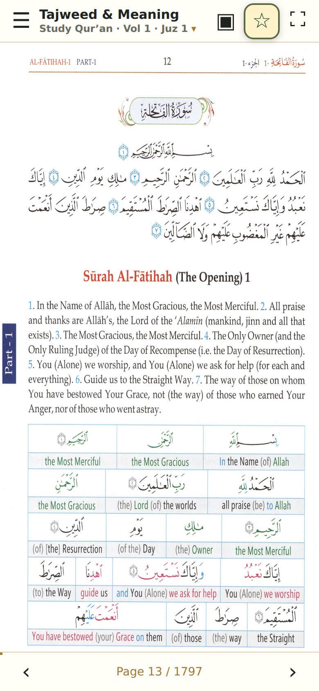
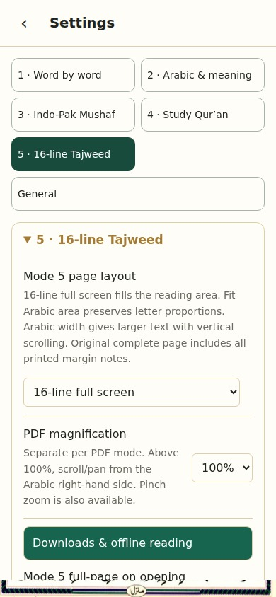
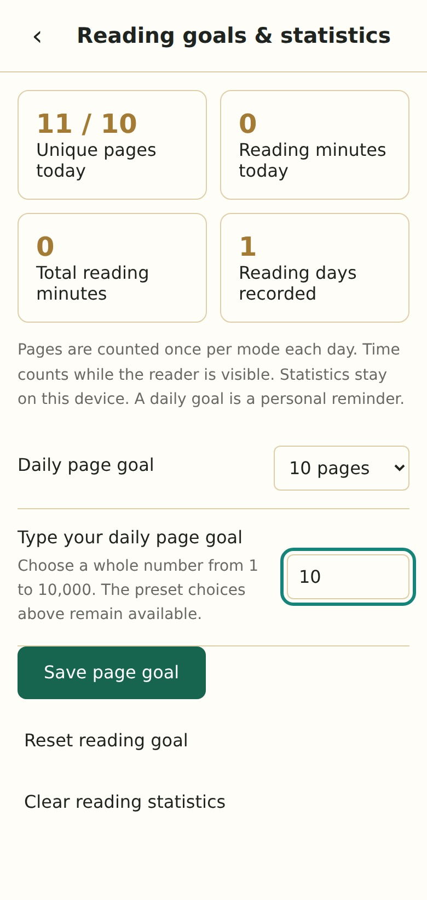

# Tajweed & Meaning — Qur’an Reader

Read, study and bookmark the Qur’an in seven reading modes. Choose your preferred page layout, set a daily reading goal and save pages for offline reading.

**[Open the website](https://codewithmohamed18.github.io/quran-word-by-word-app/)** · **[Download Android v1.9](https://github.com/codewithmohamed18/quran-word-by-word-app/releases/download/v1.9/Tajweed-and-Meaning-v1.9.apk)** · **[Release and checksums](https://github.com/codewithmohamed18/quran-word-by-word-app/releases/tag/v1.9)**

## Seven reading modes

The same order appears in the reader and Settings. Switching modes preserves each mode’s reading position and bookmarks.

| Mode | Name | What you read |
|---|---|---|
| 1 | Madina Mushaf 15 lines | Traditional 15-line Madina pages |
| 2 | Word by word full page translation | Full pages with Arabic words and their translation |
| 3 | Ayat by ayat Quran with meaning | Verse-by-verse Arabic and meaning |
| 4 | Word to word Quran with meaning | Study the Noble Quran, combined three-volume edition |
| 5 | 13-line colour-coded Tajweed | Original colour-coded 13-line pages |
| 6 | 15-line colour-coded Tajweed | Original colour-coded 15-line pages |
| 7 | 16-line colour-coded Tajweed | Original colour-coded 16-line pages |

### Mode 1 · Madina Mushaf 15 lines

### Mode 2 · Word by word full page translation

### Mode 3 · Ayat by ayat Quran with meaning

### Mode 4 · Word to word Quran with meaning

### Mode 5 · 13-line colour-coded Tajweed

### Mode 6 · 15-line colour-coded Tajweed

### Mode 7 · 16-line colour-coded Tajweed

## Get started

1. Open the website or install the Android APK.
2. Open the reading-mode menu and choose a mode.
3. Use **Surahs** to jump to a Surah, or page navigation to move through the book.
4. Open **Settings** and select the section for your mode to adjust the page layout and magnification.
5. Tap the page in full-screen reading to reveal the controls. Use the bookmark control to save your position; controls stay away from the Arabic text.

Your reading positions, settings, bookmarks and statistics are stored on your device. Each browser and the APK have separate saved data. Use the backup/export and restore/import options to keep a copy or move supported data between devices.

## Install

**Android:** download `Tajweed-and-Meaning-v1.9.apk` from the release above. Open the downloaded file and allow installation from the browser or file manager if Android asks. Requires Android 8 or newer. This refreshed v1.9 uses a higher Android build number, so it can update the earlier v1.9 installation. It uses the same application identity and signing key to retain that installation’s data.

**iPhone / iPad:** open the website in Safari, tap **Share → Add to Home Screen**. Open the new Home Screen icon to read like an app. APK files are for Android; IPA and simulator packages are not offered.

**Computer:** open the website in your browser. Use the browser’s install option if available.

## Settings explained

| Section | What it controls |
|---|---|
| Reading modes 1–7 | Separate settings for each reading mode, in the order shown above |
| Page layout | Fit and framing choices for the selected scanned reading mode |
| Magnification | Zoom for that mode; begin at 100% and adjust as needed |
| Text options | Arabic and meaning display options where available |
| Bookmarks and saved positions | Return to the reading location you saved |
| General | Shared preferences, daily goal, statistics reset and backup options |
| Offline reading | Prepare supported pages while connected, and check download progress |

Layout choices depend on the mode. When zoomed in, drag or scroll to move around the page. Select another layout if you prefer a full-page view or a wider reading view. Full-screen controls can be revealed by tapping the page.

## Daily page goal and statistics

Keep the existing goal presets **1, 5, 10, 15, 20, 30, 60 or 120 pages**, or type a whole number in **Custom daily page goal** and press **Save page goal**. Custom goals from **1 to 10,000 pages** are supported and also appear in the goal selector.

The goal can be changed in reading statistics and **Settings → General**. **Reset reading goal** returns the goal to 10 pages. **Clear reading statistics** asks for confirmation and clears recorded reading activity while keeping bookmarks and settings.

## Offline reading

The Android APK includes Modes **1, 2, 3, 5, 6 and 7**, including all 3,617 scan pages across the five scanned editions. It is a large download because the original page images are included. Mode 4 remains downloadable separately and uses saved-page caching.

On the website, connect to the internet before preparing offline reading. Use the offline/download controls and wait for completion before disconnecting. Browser storage space varies; browsers may remove stored pages when device storage is low. Keep the original web app installed and avoid clearing its site data if you want to retain offline pages and bookmarks.

## Sources and releases

Qur’an page images retain the original Arabic and printed Tajweed colours. Display settings change the view, not the verses or their meanings.

- Study edition: [Study the Noble Quran — Kalamullah](https://www.kalamullah.com/study-the-noble-quran.html).
- 16-line edition: [original Tajweed PDF](https://quranpdf.wordpress.com/wp-content/uploads/2014/12/quran-16-lines-tajwedi-hammad-company1.pdf).
- Other source information and checksums are recorded with the reader assets and repository configuration.
- Source code and bundled third-party resources retain their applicable notices; see [THIRD-PARTY-NOTICES.txt](THIRD-PARTY-NOTICES.txt).

The GitHub website is hosted on GitHub Pages. Android releases are available publicly under **Releases**; a GitHub account is not required to download the APK. The release includes a SHA-256 checksum and a source manifest identifying the website version used for the build.

Build workflows verify source assets, build the reader, capture these screenshots from the actual app and run Android checks before replacing the public APK.
